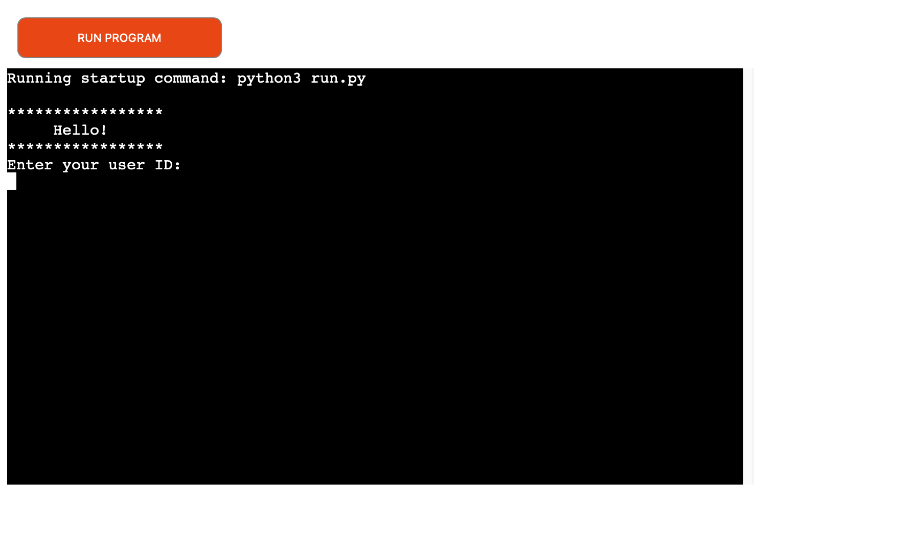

# Noth, East & South Banks ATM System

## General Overview
North, East & South Banks ATM System is a Python ATM terminal application.  Users can make various imaginary transactions: withdrawals, deposits, transfers, displaying their balances as well as recent transactions.  The data of the customers, accounts and transactions are stored in three separate tables named “Users,” “Accounts” and “Transactions” in google spread sheets. 

## How to use the program
- First the users will be greeted and will enter their ID.  
- Then they will be asked to choose among following transactions:

a.  Withdraw
b.  Deposit
c.  Transfer
d.  View the account balances
e.  View recent transactions (from the past 30 days)
f.  Exit

*Notes about user and account IDs*
- User IDs have 7 digits.  The first number tells which bank the customer belongs to.  (‘1’ indicates North Bank; ‘2’: East Bank; ‘3’: South Bank.)  The rest 6 digits are for identifying customers.  
- The account IDs have 8 digits.  The first number tells which bank the accounts belong to, just as user IDs, and the second number tells if the account is savings or checking account.  ‘1’ indicates savings account, and ‘2’ indicates checking account.  For example, 11000001 is an ID of a savings account at North Bank.  12000001 is an ID of a checking account at North Bank.
- Each customer should have unique user and account IDs.  

A. Withdraw
- Users will enter the amount they want to withdraw in a multiple of 10.
- If the requested withdrawal amount is greater than the balance in their account, the system will tell them there isn’t sufficient money for the transaction, and the program will be terminated.  
- Otherwise the new balance will be calculated and updated and the transaction record will also be added to the data system.  

B. Deposit
- In real scenario, users will insert money, and the machine will count the value.  In this program, users need to input the value manually. 
- The new balances and the transaction record will be updated.

C. Transfer
- Users will input:
1. whether they are making the transfer from their savings account or checking account
2. the recipient’s account ID 
3. the amount of money to transfer 
4. transfer notes (optional, max 35 characters)

- They will be asked to reenter valid values if 
1. the recipient’s ID is not found in the data system
2. the account ID from which the user wants to make the transfer is entered as recipient’s ID
3. empty strings or non-numeric values are entered as transfer amount

- The program will be terminated, if the specified account of the sender doesn’t have sufficient money for the transfer.
- Users can transfer money from their own checking account to their savings account, and vice versa.  
- The money value should be entered in the form of an integer or with values of cents (e.g. “50” or “50.00”)

D. View your balances
- The system will obtain the balances of users' savings and checking accounts and will display them in a table.  

E. Transactions
- The system will acquire the given user's transaction history in both accounts from the past 30 days and display them in a table.

F. Exit
- The program will be terminated.  

Lastly, after each transaction, the system asks the users if they want to make further transactions.  Until they decide to exit the program, they can continue to make transactions.

## Future features:
- I will write program that will have users enter pin numbers for login and a validation system.

# Testing:
- I passed the code through CI Python Linter and confirmed there are no problems.
- I tested all possible input options and confirmed that the interaction between the system and the users flow well.
- I tested that if users enter invalid inputs, (such as characters, an empty string, spaces or 0 where a non-zero number is expected.) the system will ask the users to reenter a valid value.  
- I tested that all prompt messages are clear and that there’s no confusion for users as to how to use the program.  

## Bugs:
- Some while loops didn't function well.  I solved the issue by placing indents correctly.

## Validator Testing: 
No errors were returned from https://pep8ci.herokuapp.com

## Deployment
This project was deployed using Code Institute's mock terminal for Heroku.
- Steps to deploy:
1. Fork or clone the repository
2. Create a new Heroku app
3. Set the buildpacks to Python and NodeJS in the order
4. Link the Heroku app to the repository
5. Click on Deploy

## Credits:
The section in this readme file "Deployment" was taken from the readme file of Love Sandwiches Project by Code Institute.
I got help from my tutor Jubril Akkolade at CI.

---
Notes for myself
How to connect APIs to the project
- go to google cloud, create a new project
- add Google Drive API
- select 'application data'
- enter name and email, select 'Editor' for the role
- go to 'Key' tab.
- click on 'add keys' and select json
- credentails will be downloaded.
- enable Google sheets API as well (enable, and no need to take further steps)
- add the downloaded file to the workspace, rename the file to 'creds.json'
- copy the email from the creds.json, go to the google spread sheet, add this email to 'Share' list